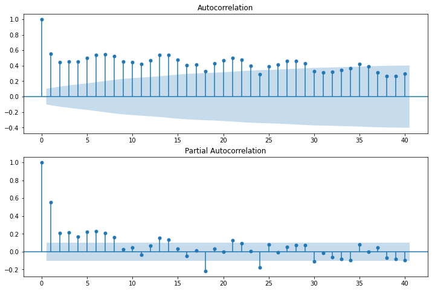
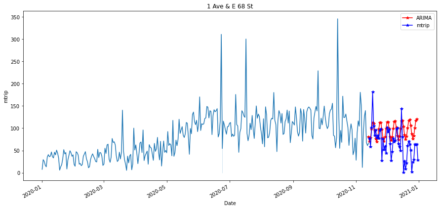
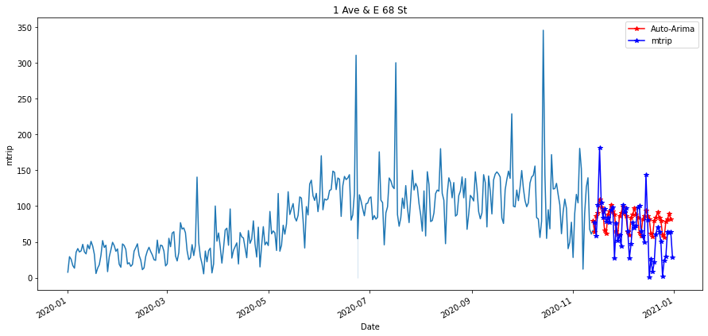
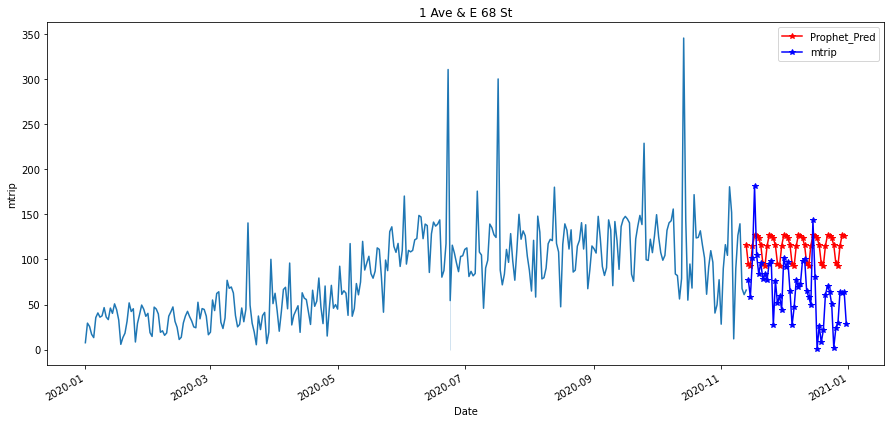
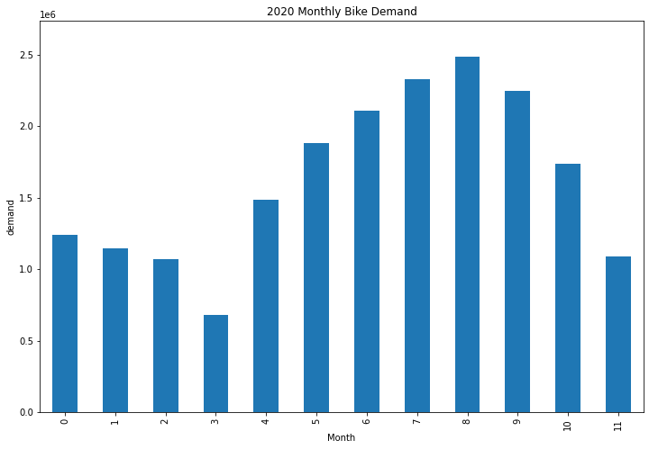
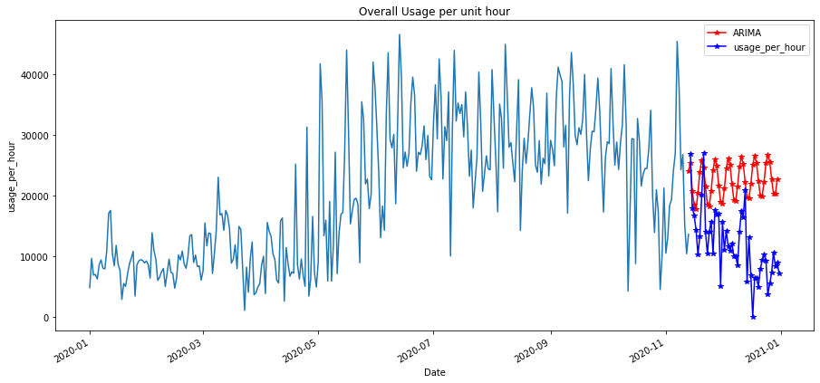

# NYC Citi Bike Time-Series Analytics

Time-series forecasting and business analytics for NYC Citi Bike demand using ARIMA, SARIMAX, Prophet, weather data, and Power BI.

## Overview

This repository presents the practical analytical work developed for my 2021 M.Sc. thesis:

**“Improvement of Bike Sharing Disposition by Business Analytics and Open Data Usage”**

The thesis was completed at **TH Köln University of Applied Sciences** in September 2021.

The project investigates how business analytics, open data, and time-series forecasting can support bike-sharing operations and planning. The analysis focuses on NYC Citi Bike usage and combines trip records with weather and operational inspection data.

## Project Objectives

The main objectives of the project were to:

- Perform descriptive and exploratory analysis of bike-sharing data
- Investigate daily, monthly, seasonal, and station-level usage patterns
- Examine relationships between weather conditions and bike usage
- Analyze trip duration and station demand
- Evaluate stationarity and temporal patterns
- Develop station-level time-series forecasting models
- Compare different forecasting approaches
- Predict overall daily and weekday bike usage
- Prepare analytical outputs for business-intelligence visualization

## Data

The primary analytical period was:

**January–December 2020**

The project used three main categories of data.

### NYC Citi Bike Trip Data

Citi Bike trip records were used to investigate:

- Daily and monthly bike usage
- Trip duration
- Station-level activity
- Seasonal usage patterns
- Ridership characteristics
- Time-series behavior

### Weather Data

Weather information, particularly **relative humidity**, was integrated with bike-sharing data to investigate relationships between environmental conditions and bike usage.

Relative humidity was also explored as an exogenous variable in the time-series analysis.

### Bike-Sharing Inspection Data

Operational inspection data was analyzed to investigate factors associated with bike-sharing operations and support the business-analytics component of the study.

The complete raw datasets are not stored in this repository because they consist of multiple large files.

See [`data/README.md`](data/README.md) for additional information.

## Analytical Workflow

The practical analysis includes:

1. Data ingestion and preprocessing
2. Monthly and seasonal aggregation
3. Exploratory data analysis
4. Station-level usage analysis
5. Trip-duration analysis
6. Weather-data integration
7. Rolling statistics and time-series visualization
8. Stationarity testing
9. Differencing
10. ACF and PACF analysis
11. Time-series model development
12. Forecast evaluation and model comparison
13. Operational inspection analysis
14. Preparation of analytical outputs for Power BI

## Time-Series Analysis

### Stationarity Testing

The **Augmented Dickey-Fuller (ADF) test** was used as part of the stationarity analysis.

Rolling statistics and differencing were also explored before developing forecasting models.

### ACF and PACF Analysis

Autocorrelation Function (**ACF**) and Partial Autocorrelation Function (**PACF**) analysis were used to investigate temporal dependencies and support time-series model development.

## Forecasting Models

Several forecasting approaches were explored and compared.

### ARIMA

**Autoregressive Integrated Moving Average (ARIMA)** models were used for time-series forecasting after examining stationarity and autocorrelation characteristics.

### Auto-ARIMA

**Auto-ARIMA** was explored to support model-order selection and forecasting experiments.

### SARIMAX

**SARIMAX** was investigated with relative humidity as an exogenous variable, allowing weather information to be incorporated into the forecasting process.

### Prophet

**Prophet** was also evaluated as an alternative forecasting approach for bike-usage time series.

### Exponential Smoothing and Power BI

The project additionally explored forecasting and trend analysis within the business-intelligence workflow, including exponential smoothing and visualization in **Power BI**.

## Selected Results

The figures below are selected outputs from the original 2021 analytical workflow. Additional figures are available in the [`results/`](results/) directory.

### ACF and PACF Analysis

ACF and PACF were used to investigate the temporal characteristics of the time series.



### Station-Level ARIMA Forecast

ARIMA was applied to station-level time-series forecasting.



### Station-Level Auto-ARIMA Forecast

Auto-ARIMA was explored as an alternative approach to model selection and forecasting.



### Station-Level Prophet Forecast

Prophet was also evaluated for station-level forecasting.



### 2020 Monthly Bike Demand

Monthly aggregation was used to examine changes in Citi Bike demand throughout the 2020 study period.



### Overall Bike-Usage Forecast

The analysis also investigated forecasting of overall bike usage.



More analytical outputs are available in the [`results/`](results/) folder.

## Repository Structure

```text
NYC-CitiBike-Time-Series-Analytics/
├── README.md
├── requirements.txt
├── .gitignore
│
├── data/
│   └── README.md
│
├── notebooks/
│   ├── README.md
│   └── CitiBike_Time_Series_Analytics.ipynb
│
└── results/
    ├── README.md
    ├── 01_acf_pacf_trip_duration.png
    ├── 02_acf_pacf_stationary_trip_duration.png
    ├── 03_arima_station_forecast.png
    ├── 04_auto_arima_station_forecast.png
    ├── 05_prophet_station_forecast.png
    ├── 06_monthly_bike_demand_2020.png
    ├── 07_auto_arima_monthly_demand_forecast.png
    ├── 08_prophet_monthly_demand_forecast.png
    ├── 09_auto_arima_overall_usage_forecast.png
    ├── 10_prophet_overall_usage_forecast.png
    └── 11_arima_overall_usage_forecast.png
```

## Main Notebook

The practical implementation is available here:

[`notebooks/CitiBike_Time_Series_Analytics.ipynb`](notebooks/CitiBike_Time_Series_Analytics.ipynb)

The notebook contains a cleaned archival version of the practical analysis performed for the original 2021 thesis project.

## Technologies

The project uses tools and libraries including:

- Python
- Pandas
- NumPy
- Matplotlib
- Seaborn
- Scikit-learn
- Statsmodels
- pmdarima
- Prophet
- Plotly
- Jupyter Notebook
- Power BI

## Installation

Python dependencies are listed in `requirements.txt`.

To install them in a local environment:

```bash
pip install -r requirements.txt
```

## Reproducibility Note

This repository preserves analytical work originally completed in **2021**.

Some Python libraries and APIs used in the original notebook have since changed or been deprecated. Examples include:

- The former `fbprophet` package, now distributed as `prophet`
- Legacy Statsmodels ARIMA APIs
- `DataFrame.append`, which has been removed from recent versions of Pandas

Minor compatibility updates may therefore be required to rerun every notebook cell in a modern Python environment.

The repository preserves the original analytical methodology and results rather than presenting recomputed results as part of the original thesis.

## Thesis Information

**Title:** Improvement of Bike Sharing Disposition by Business Analytics and Open Data Usage  
**Author:** Nafiu Ikeoluwa Hammed  
**Degree:** Master of Science (M.Sc.) Informatik-Computer Science  
**Institution:** TH Köln University of Applied Sciences  
**Institute:** Institute of Informatics  
**Year:** 2021

## Portfolio Note

The original M.Sc. thesis and practical analysis were completed in **2021**.

This repository was subsequently curated for portfolio presentation. The repository organization and documentation have been improved while preserving the original analytical work and historical context.
