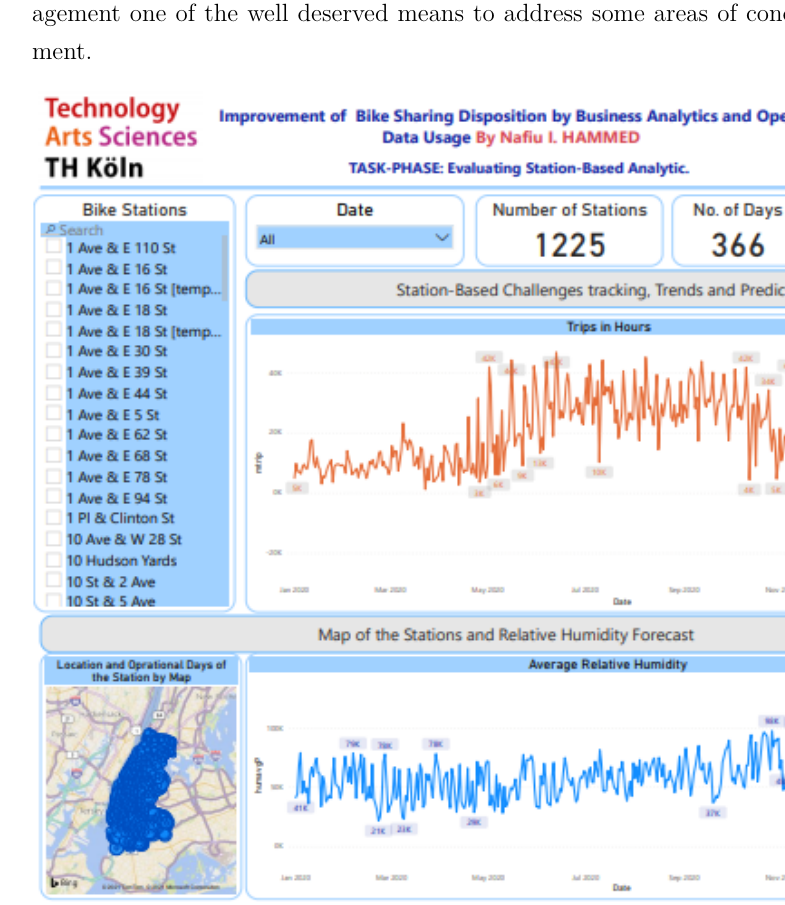
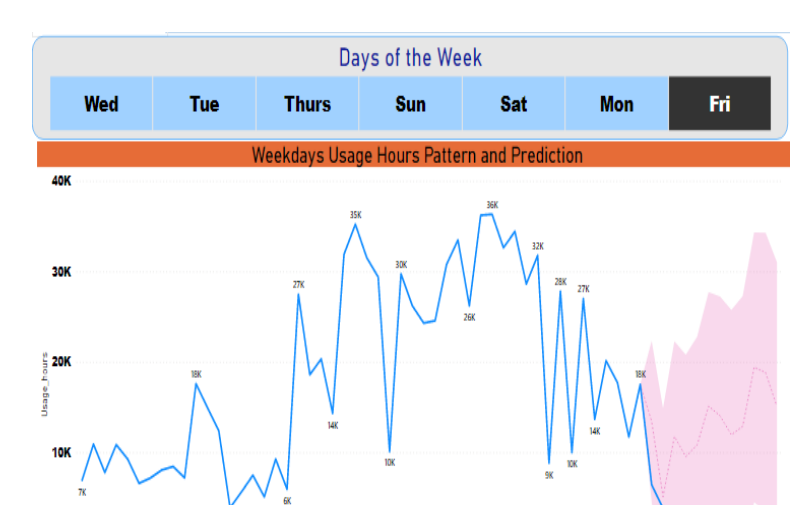

# NYC Citi Bike Time-Series Analytics

Time-series forecasting and business analytics for NYC Citi Bike demand using ARIMA, Auto-ARIMA, SARIMAX, Prophet, weather data, and Power BI.

## Overview

This repository presents the practical analytical work developed for my 2021 M.Sc. thesis:

**“Improvement of Bike Sharing Disposition by Business Analytics and Open Data Usage”**

The thesis was completed at **TH Köln University of Applied Sciences** in September 2021.

The project investigates how business analytics, open data, and time-series forecasting can support bike-sharing operations and decision-making. The analysis focuses on NYC Citi Bike activity during 2020 and combines bike-sharing data with weather information and operational inspection data.

The work includes exploratory analysis, station-level analytics, time-series diagnostics, forecasting, model comparison, operational analysis, and Power BI visualization.

---

## Project Objectives

The main objectives of the project were to:

- Perform descriptive and exploratory analysis of bike-sharing activity
- Investigate daily, monthly, seasonal, and station-level usage patterns
- Examine the relationship between relative humidity and bike usage
- Analyze trip duration and station activity
- Examine stationarity and temporal dependencies in the time series
- Develop station-level forecasting models
- Compare alternative time-series forecasting approaches
- Investigate overall daily bike-usage forecasting
- Analyze weekday usage patterns
- Evaluate station-level activity through a business-intelligence environment
- Use Power BI forecasting and visualization to support management-oriented interpretation

---

## Data

The primary analytical period was:

**January–December 2020**

The project used three main categories of data.

### 1. NYC Citi Bike Trip Data

NYC Citi Bike trip records were used to investigate:

- Daily and monthly bike usage
- Trip duration
- Station-level activity
- Seasonal usage patterns
- Ridership characteristics
- Time-series behavior
- Overall bike-usage patterns

### 2. Weather Data

Weather information, particularly **average daily relative humidity**, was incorporated into the analysis to investigate the relationship between environmental conditions and bike-sharing activity.

Relative humidity was also explored as an exogenous variable in the time-series modeling.

### 3. Bike-Sharing Inspection Data

Operational inspection data was analyzed to investigate external factors associated with bike-sharing operations and to support the business-analytics component of the project.

### Why the Raw Data Is Not Included

The complete 2020 dataset consists of multiple large source files and is therefore not stored directly in this repository.

The repository instead preserves the analytical workflow, selected results, and documentation.

See [`data/README.md`](data/README.md) for additional information about the datasets.

---

## Analytical Workflow

The practical workflow includes:

1. Data collection and preprocessing
2. Data cleaning and transformation
3. Monthly and seasonal aggregation
4. Exploratory and descriptive analysis
5. Weather-data integration
6. Station-level analysis
7. Trip-duration analysis
8. Rolling statistics and time-series visualization
9. Stationarity testing
10. Differencing
11. ACF and PACF analysis
12. Time-series model development
13. Forecast evaluation and model comparison
14. Overall bike-usage forecasting
15. Operational inspection analysis
16. Power BI visualization and forecasting

---

## Time-Series Analysis

### Stationarity Testing

The **Augmented Dickey-Fuller (ADF) test** was used as part of the stationarity analysis.

Rolling statistics and differencing were also explored before developing forecasting models.

### ACF and PACF Analysis

The **Autocorrelation Function (ACF)** and **Partial Autocorrelation Function (PACF)** were used to investigate temporal dependencies and support the development of the time-series models.

---

## Forecasting Models

Several forecasting approaches were explored during the project.

### ARIMA

**Autoregressive Integrated Moving Average (ARIMA)** models were used for time-series forecasting after examining stationarity and temporal dependencies in the data.

### Auto-ARIMA

**Auto-ARIMA** was explored to support automated model-order selection and forecasting experiments.

### SARIMAX

**Seasonal Autoregressive Integrated Moving Average with Exogenous Regressors (SARIMAX)** was investigated with relative humidity as an exogenous variable.

This allowed weather information to be considered alongside the historical bike-usage time series.

### Prophet

**Prophet** was evaluated as an alternative forecasting approach for bike-usage time series, particularly in the presence of seasonal behavior.

### Forecast Evaluation

The forecasting approaches were compared using measures including **Root Mean Squared Error (RMSE)**, while model characteristics were also examined using criteria such as the **Akaike Information Criterion (AIC)**.

---

## Selected Time-Series Results

Selected outputs from the original 2021 analytical workflow are displayed below.

Additional figures are available in the [`results/`](results/) directory.

### ACF and PACF Analysis

ACF and PACF analysis was used to examine the temporal characteristics of the trip-duration time series.


### Station-Level ARIMA Forecast

ARIMA was applied to station-level time-series forecasting.


### Station-Level Auto-ARIMA Forecast

Auto-ARIMA was explored as an alternative approach to model selection and station-level forecasting.


### Station-Level Prophet Forecast

Prophet was also evaluated for station-level forecasting.


### 2020 Monthly Bike Demand

Monthly aggregation was used to examine changes in Citi Bike demand throughout the 2020 study period.


### Overall Bike-Usage Forecast

The project also investigated forecasting of overall daily bike usage.


All selected Python/time-series figures are available in the [`results/`](results/) directory.

---

## Power BI Business Analytics

Power BI was used to complement the Python-based time-series analysis with a business-intelligence perspective.

The BI component was designed to provide a more interactive, management-oriented view of station activity, bike usage, geographic information, relative humidity, operational patterns, and forecasting.

### Station-Based Operational Dashboard

The station-based dashboard combined information including:

- Bike-sharing stations
- Daily bike-usage activity
- Station operating patterns
- Geographic station locations
- Relative humidity
- Monthly ridership
- Time-series forecasting

It was designed to support the identification of station-level operational patterns and interruptions and to provide a visual basis for investigating stations that may require additional operational attention.



### Exponential-Smoothing Forecasting

The project explored **exponential smoothing within Power BI** as part of the evaluation of station-based analytics.

The BI forecasting component was used to visualize historical behavior and potential future patterns while providing a more accessible presentation for business stakeholders.

### Weekday Usage and Forecasting

The analysis was also extended to weekday-based bike-usage patterns.

The original 2020 analysis found that total bike-usage hours tended to be higher toward the weekend. **Saturday recorded the highest total usage hours at approximately 1.3 million hours**, followed by Sunday at approximately 1.2 million hours.



Additional information about the Power BI outputs is available in the [`dashboard/`](dashboard/) directory.

---

## Business Analytics Perspective

The project was developed not only as a forecasting exercise but also as a business-analytics investigation.

Station-level analysis was used to investigate issues such as:

- Operational interruptions
- Stations with incomplete operating periods
- Station usage patterns
- Potential station rebalancing considerations
- Geographic identification of affected stations
- Monthly business activity
- Weather-related patterns
- Inspection-related operational factors
- Overall and station-level forecasting

The objective was to demonstrate how open data, statistical analysis, forecasting, and business-intelligence tools could be combined to provide information useful for bike-sharing operational decision-making.

---

## Repository Structure

```text
NYC-CitiBike-Time-Series-Analytics/
│
├── README.md
├── requirements.txt
├── .gitignore
│
├── data/
│   └── README.md
│
├── notebooks/
│   ├── README.md
│   └── CitiBike_Time_Series_Analytics.ipynb
│
├── results/
│   ├── README.md
│   ├── 01_acf_pacf_trip_duration.png
│   ├── 02_acf_pacf_stationary_trip_duration.png
│   ├── 03_arima_station_forecast.png
│   ├── 04_auto_arima_station_forecast.png
│   ├── 05_prophet_station_forecast.png
│   ├── 06_monthly_bike_demand_2020.png
│   ├── 07_auto_arima_monthly_demand_forecast.png
│   ├── 08_prophet_monthly_demand_forecast.png
│   ├── 09_auto_arima_overall_usage_forecast.png
│   ├── 10_prophet_overall_usage_forecast.png
│   └── 11_arima_overall_usage_forecast.png
│
└── dashboard/
    ├── README.md
    ├── powerbi_station_dashboard.png
    └── powerbi_weekday_forecast.png
```

---

## Main Notebook

The practical implementation is available in:

[`notebooks/CitiBike_Time_Series_Analytics.ipynb`](notebooks/CitiBike_Time_Series_Analytics.ipynb)

The notebook is a cleaned archival version of the practical analytical work developed for the original 2021 thesis.

---

## Technologies

The project uses tools and libraries including:

- Python
- Jupyter Notebook
- Pandas
- NumPy
- Matplotlib
- Seaborn
- Scikit-learn
- Statsmodels
- pmdarima
- Prophet
- Plotly
- Power BI

---

## Installation

Python dependencies are listed in `requirements.txt`.

To install the required packages in a local environment:

```bash
pip install -r requirements.txt
```

---

## Reproducibility and Compatibility Note

This repository preserves analytical work originally completed in **2021**.

Some Python libraries and APIs used in the original implementation have changed or been deprecated since the project was completed. Examples include:

- The former `fbprophet` package, now distributed as `prophet`
- Legacy Statsmodels ARIMA APIs
- `DataFrame.append`, which has been removed from recent versions of Pandas

Minor compatibility modifications may therefore be necessary to execute every notebook cell in a current Python environment.

The purpose of this repository is to preserve and present the original analytical methodology and results rather than to recompute the historical analysis using newer software versions.

---

## Thesis Information

**Title:** Improvement of Bike Sharing Disposition by Business Analytics and Open Data Usage  
**Author:** Nafiu Ikeoluwa Hammed  
**Degree:** Master of Science (M.Sc.) Informatik-Computer Science  
**Institution:** TH Köln University of Applied Sciences  
**Institute:** Institute of Informatics  
**Completed:** September 2021

---

## Archival and Portfolio Note

The original M.Sc. thesis and practical analysis were completed in **2021**.

This repository was subsequently curated for portfolio presentation. Repository organization, documentation, and presentation have been improved while preserving the methodology, analytical outputs, and historical context of the original work.

The results presented here should therefore be interpreted as outputs from the original 2021 study rather than newly recomputed benchmark results.
